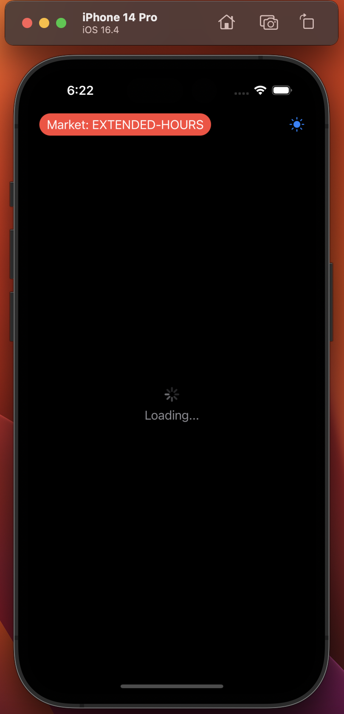

# Stock Market Insights App (iOS) 📈

An iOS application that provides users with real-time stock market data and related news, developed using SwiftUI.

## Screenshots

  
   

## Features:

- **Searchable Dropdown**: Allows users to search for and select specific stock tickers.
- **Dynamic Market Data**: Offers real-time stock data visualizations, including Simple Moving Average (SMA) and other pivotal indicators.
- **Real-time News Feed**: Integrated news API showcases the most recent news articles related to a user's chosen stock ticker.
- **Dark Mode Support**: Seamlessly switch between light and dark themes using an intuitive icon-based toggle.
- **Optimized Data Fetching**: Asynchronous API calls ensure the app stays responsive and data-rich.

## Technical Stack:

- **Language**: Swift
- **Framework**: SwiftUI
- **Networking**: Alamofire

## How to Run:

1. Clone the repository: `git clone [repository-link]`
2. Install necessary dependencies (like Alamofire): `pod install`
3. Open the `.xcodeproj` or `.xcworkspace` file in Xcode.
4. Choose your simulator or device.
5. Hit the run button.

## Contributions:

Feel free to fork this project, submit PRs, and open issues. Your feedback and contributions are always appreciated!

